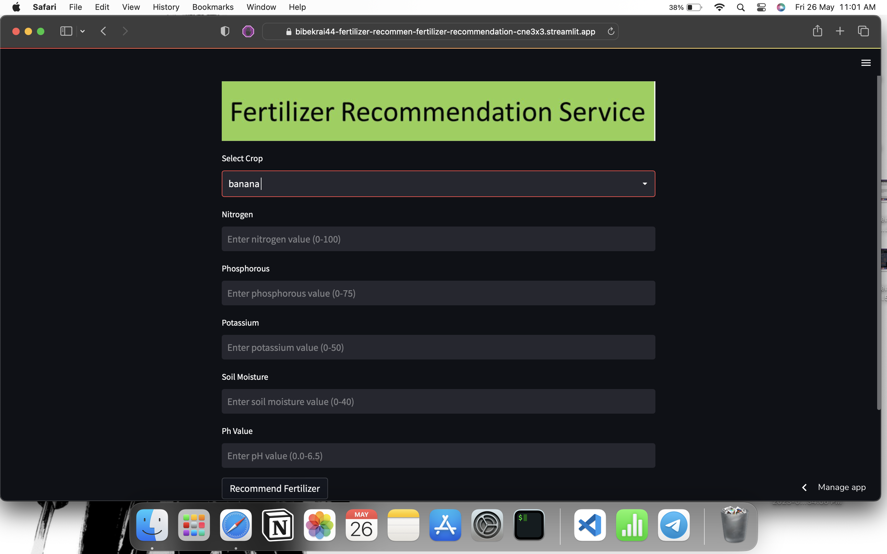
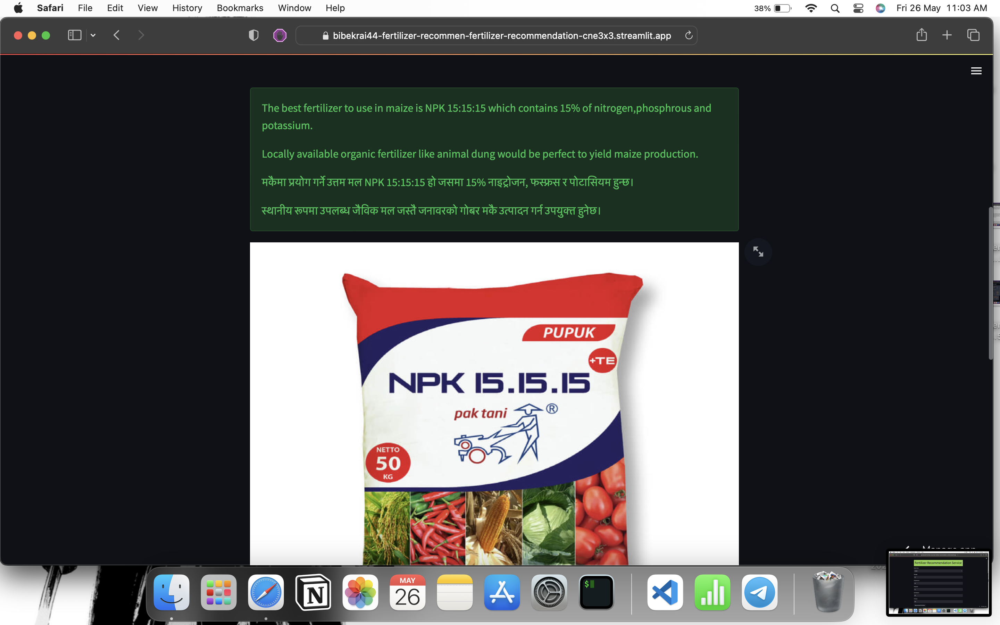
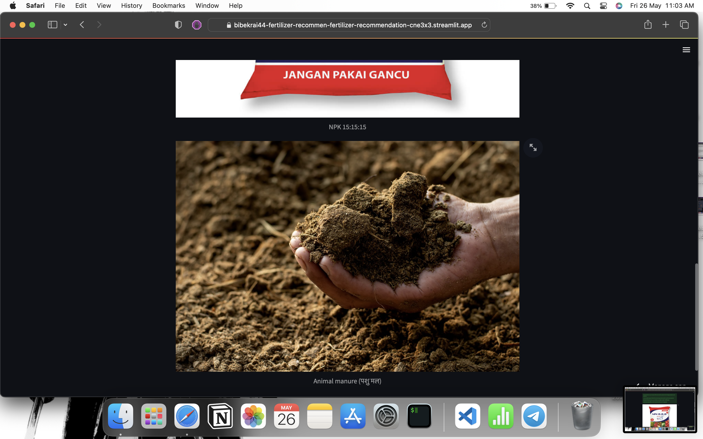

# Fertilizer Recommendation System
A simple app that suggest you to use suitable fertilizer for your crop according to your soil chemical properties.

## How this project is done ?
Publicly available data was less so ML model could not be trained so I researched on my own. This project is more like research based where the fertilizer recommendation is provided through research rather than data driven. The fertilizer research is done through visiting different articles,pdf,forum etc available on internet.

## What tech stack is used here?
 1) Python 
 2) Streamlit(open source python library) for creating app

## Project Image

## I will integrate new features in this in upcoming days.
# Thank You 😁
